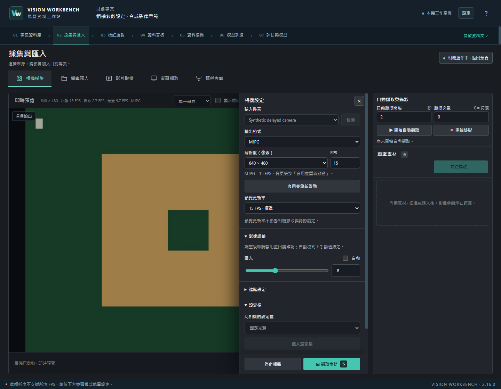

# Vision Workbench

Windows 桌面視覺資料工作台，整合影像採集、標註、審核與模型訓練。專案資料與模型保存在本機。

[](https://github.com/kongbai0123/vision-workbench/actions/workflows/ci.yml)
[](LICENSE)
[](#快速開始)

[快速開始](#快速開始) · [相機設定](docs/camera.md) · [使用指南](docs/usage.md) · [開發指南](docs/development.md) · [版本紀錄](CHANGELOG.md)

```text
採集／匯入 → 標註 → 審核 → 資料準備（分割／增強）→ 訓練 → 評估與預標註
```



*合成影像示範：右側調整相機輸出與曝光，底部操作列持續可用；可用參數依實際裝置而異。*

## 核心功能

- **資料採集**：相機、圖片、影片畫格與螢幕擷取；支援定時拍攝、錄影及原圖／處理結果比較。
- **相機控制**：輸出格式、解析度與 FPS 連動；曝光、增益、白平衡、對焦及進階畫質依裝置能力顯示，支援回讀驗證與本機設定檔。
- **標註編輯**：同視窗切換內建編輯器、Labelme 與本機 CVAT，支援 SAM2／GrabCut 輔助分割。
- **資料管理**：人工審核、修訂追蹤、依來源分組的資料分割、Train-only 資料增強，以及可隨專案備份的固定資料版本。
- **模型訓練**：支援物件偵測、實例分割、語意分割與圖片分類，提供訓練曲線及模型比較。
- **外部模型匯入**：可拖曳或用檔案瀏覽器選擇 Ultralytics 相容的 YOLO／RT-DETR `.pt` 權重；驗證後用於圖片／影片試跑與預標註，並保留來源與類別資訊。
- **資料交換**：COCO、YOLO、LabelMe、JSONL 與原生格式匯入／匯出，以及模型封裝匯出。

## 相機參數工作流程

在「採集與匯入 → 相機採集 → 相機設定」完成拍攝設定，直接對照左側即時預覽。

1. **選擇輸出**：偵測裝置，選擇自動／指定格式、解析度與 FPS；運作中可按「套用並重新啟動」。
2. **調整影像**：切換自動／手動曝光與白平衡，用滑桿或數值欄位微調；每次套用都回讀驅動結果。
3. **保存條件**：替目前設定命名，下一次停機時載入並啟動；快照來源紀錄保留相機參數。

預覽更新率可獨立選擇 5／10／15／30 FPS。介面分別顯示驅動回報、擷取與預覽幀率，輸出不符或持續低幀率時提供提示。停止與擷取按鈕固定於面板底部。

硬體參數目前透過 Windows DirectShow 提供；可用項目與範圍取決於相機及驅動。裝置不支援的控制項不會顯示，切換至其他擷取後端時仍可使用基本預覽與採集。詳見[相機設定與疑難排解](docs/camera.md)。

## 快速開始

需要 Windows 10／11（64 位元）與 Python 3.13。首次安裝需連線下載套件。

```powershell
git clone https://github.com/kongbai0123/vision-workbench.git
cd vision-workbench
powershell -NoProfile -ExecutionPolicy Bypass -File .\bootstrap.ps1
.\vision-workbench.bat
```

後續直接開啟 `vision-workbench.bat`。

訓練模型的選配環境可於「設定 → 模型與元件」安裝。SAM2 與 CVAT 的準備方式見[使用指南](docs/usage.md)。

## 文件

- [使用指南](docs/usage.md)：選配元件、標註流程、資料分割、模型評估與備份。
- [相機設定](docs/camera.md)：輸出模式、即時硬體參數、設定檔與 FPS 診斷。
- [模型匯入與試跑](docs/model-assistance-workflows.md)：外部權重、預標註、資料交換及相容性限制。
- [開發指南](docs/development.md)：本機開發、程式結構與測試。
- [版本紀錄](CHANGELOG.md)
- [問題回報](https://github.com/kongbai0123/vision-workbench/issues)

## 回報問題與參與開發

歡迎提交 Issue 或 Pull Request。回報相機問題時，請附上軟體版本、Windows 版本、相機型號、要求與實際輸出模式、重現步驟，以及不含私人影像的截圖。開發前請先閱讀[開發指南](docs/development.md)，並執行對應的 Python、JavaScript 與桌面流程測試。

## 授權

本專案採用 [MIT License](LICENSE)。第三方元件與模型權重適用各自授權，選用前請查閱元件說明。
