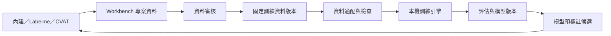

# Vision Workbench × Vision Training Studio 整合規劃

日期：2026-09-14。狀態：設計草案；本次只檢視原始碼並整理規劃，尚未實作訓練整合。

## 1. 建議方向

以 Vision Workbench 作為唯一主要操作介面與圖片／標註資料來源，重用 Vision Training Studio 的訓練、Run、評估、模型與推論服務。使用者從「資料審核」直接進入訓練，無須手動建立匯出資料夾、選擇交換格式，再到另一個軟體匯入。

訓練需要的資料整理與格式適配仍由背景程序執行。現有匯出中的資料分割、幾何驗證、類別檢查與轉換報告應保留並轉為訓練前檢查；資料備份／外部交換保留在專案的進階功能。

第一個整合範圍建議聚焦影像專案。Training 現有的序列與表格工作區維持原用途；日後依資料型態新增入口，不將其欄位放進影像專案。

## 2. 已確認的程式現況

| 區塊 | 可重用內容 | 整合時必須補齊 |
| --- | --- | --- |
| Workbench 資料管理 | SQLite 交易、圖片雜湊、標註修訂、審核、專案快照 | 訓練資料版本的持久保存及引用關係 |
| Workbench 三個編輯器 | 內建、Labelme、CVAT 的共享標註與切換同步 | 建立訓練資料前套用同一個存檔／同步關卡 |
| Workbench 分割／驗證 | train/val/test、類別分布、幾何及格式轉換檢查 | 模型能力檢查、來源群組洩漏檢查、訓練負樣本規則 |
| Training API | readiness、start、status、stop、Run 指標、產物與比較 | Workbench 專案與資料版本的適配入口 |
| Training 資料來源 | project.json 的 images[]、class_names 與 v3 目錄結構 | 原生 RLE／bitmap 讀取，不能直接指向 Workbench DB 當成現有 Training 專案 |
| Training 產物 | Run 設定、metrics、summary、checkpoint、artifact manifest | 完整 dataset lineage；每個模型的評估、推論、匯出能力驗收 |
| 執行環境 | 各自的本機 Python／模型套件 | 分開鎖定依賴、程序生命週期、GPU 排程 |

目前程式中的重要限制：

- Workbench 的可選 AI 使用 torch 2.7.1 / CUDA 12.8、transformers 5.16.1；Training 的需求為 torch 2.5.1 / CUDA 12.1、transformers 4.52.2。應使用各自的執行環境。
- Training 的 COCO RLE 匯入會經外輪廓及多邊形近似；不能直接用這條路徑保證遮罩孔洞或多區塊實例不變。
- 現有 TorchVision instance loader 由 polygon 或 bbox 產生 mask，尚未直接讀取 Workbench 的 RLE。
- Training 的 dataset_snapshot.json 主要記錄 filename、split 等摘要；無法單靠這份檔案重建當時的完整標註。
- Mask R-CNN 已有訓練後端，但目前 catalog 未宣告推論支援，驗證路徑也不能直接當成完整的 mask AP／IoU 評估。這些需要一起補齊。
- 現有 Workbench 自動分割會將完全相同的圖片分在同一組，並未將整個拍攝批次視為不可拆分群組。應保留此策略，另提供依影片／拍攝批次分組的選項與明確檢查結果。

## 3. 使用者流程與版型

保留 Workbench 的深色背景、青綠重點色、頂部專案列、階段導覽、按鈕及狀態列樣式。新增頁面沿用其元件與用語。

建議頂部階段：

| 階段 | 主要內容 |
| --- | --- |
| 01 專案資料庫 | 每個專案增加已核准影像數、最近訓練與目前使用模型摘要 |
| 02 採集與匯入 | 保留圖片、影片、相機與資料匯入 |
| 03 標註編輯 | 保留三編輯器切換、專案標註同步 |
| 04 資料審核 | 核准／退回；增加「準備訓練」入口 |
| 05 模型訓練 | 訓練資料、參數設定、執行紀錄三個分頁 |
| 06 評估與模型 | 指標、錯誤樣本、Run 比較、模型版本、測試與模型輸出 |

「05 模型訓練」版面：

- 左側：資料版本、已核准／排除張數、類別與分割分布、檢查結果。
- 中央：任務與模型選擇、常用訓練參數、訓練期間的曲線與樣本預覽。
- 右側：裝置、預估資源需求、開始／停止控制、目前 Run 摘要；進階參數摺疊呈現。
- 底部：一致的背景任務列，顯示資料準備、訓練、評估或模型下載的實際狀態。

選模型時只呈現與任務相容的選項，並分別顯示是否支援訓練、評估、推論與輸出。指標按任務呈現，不以同一個「準確率」代表偵測、分類和分割。

「06 評估與模型」的錯誤樣本能直接回到「03 標註編輯」的同一張原圖。模型推論結果先成為候選標註，使用者接受後仍回到「04 資料審核」，不直接覆蓋已核准標註。

## 4. 資料流與所有權

資料所有權：

1. **Workbench 專案**管理圖片、標註、類別與審核狀態；Training 不直接改寫這份資料庫。
2. **DatasetVersion**是不可變的已核准資料快照。Training 取得該版本的受控讀取資料。
3. **TrainingRun**綁定資料版本、模型、參數與執行環境；Training 管理執行細節，Workbench 保存關聯與顯示摘要。
4. **ModelVersion**綁定產生它的 Run、類別映射、前後處理及評估資料。
5. Training 舊專案如需接回 Workbench，透過一次性顯式匯入與映射；不建立兩邊互相改寫的同步迴圈。

### 訓練資料版本

每個版本至少保存：

- schema_version、dataset_version_id、Workbench project_id、來源 project_revision。
- asset_id、原圖 SHA-256、尺寸、標註 revision、完整 shapes 及 annotation hash。
- 固定的 class ID／名稱映射；backend 如需背景類別偏移，另外記錄映射。
- 保留 annotation ID 與 asset ID；檔名相同的不同圖片仍須能區分，不以 basename 或可變的類別排列作為身分識別。
- 固定的 train/val/test 成員、來源 batch／影片關係與分割策略。
- 選用圖片與排除原因、幾何驗證結果、轉換規則及轉換影響。
- 增強設定與 seed、producer／adapter 版本、建立時間。

建立版本採原子發布；引用的原圖需要由版本資料保存機制保護，避免編輯中刪除圖片或專案導致舊 Run 失去資料。首版可使用受管理副本，後續再做內容去重；不得假設原始 image_path 永遠存在。

例：Run A 使用 D001。使用者在 CVAT 修改圖片後，該圖片回到待審核。重新核准後建立 D002，新的 Run 使用 D002；Run A 的輸入、結果及重現資訊仍指向 D001。

一般存檔或核准不會自行啟動 GPU 訓練。「開始訓練」才建立 Run；重複按鈕／重試請求以同一個 idempotency key 避免產生兩份任務。

### 幾何與資料品質

- RLE／bitmap 優先保留遮罩像素、孔洞、instance ID 與多區塊歸屬。
- 從 mask 產生 detection bbox 時，取非零像素範圍，明確轉換 inclusive／exclusive 座標，不使用整張 mask canvas 的 width／height。
- 整張分類、物件偵測、實例分割及語意分割需要各自的資料規則；不可自動將多物件類別猜成整張圖片的分類。
- point、linestrip、OBB 等依模型能力處理；無對應能力就列為準備阻擋項，不能悄悄略過。
- 若選擇只接受 polygon 的 backend，必須顯示近似或孔洞損失；保真模式下阻止此轉換。
- 資料增強只作用於 Train；原始影像及其增強結果不得跨集合。
- 來源群組隔離和類別平衡可能衝突；不足時提示需要補採資料，不能用資料洩漏補足類別。
- 固定測試集，Run 比較顯示評估資料版本；不同測試集的結果不能當成相同條件排名。

## 5. 技術接法

### Workbench 端

建議新增以下職責模組（名稱為規劃，尚未建立）：

- training_service：編輯同步、建立 DatasetVersion、訓練前檢查、建立／取消 Run。
- training_bridge：本機引擎啟動、能力握手、版本檢查、API 請求與狀態回收。
- dataset_versions：快照發布、雜湊、類別映射、資料保留及引用計數。
- model_versions：模型來源、評估、選用模型及回填候選的關聯。
- Web 訓練／評估頁：沿用 Workbench 元件，不引入第二套完整專案導覽。

### Training 端

- 新增受控的 Workbench snapshot 適配入口，將資料版本映射到現有 ProjectLayout／images[]／class_names。
- 每個資料版本使用獨立且固定的訓練資料位置；避免目前專案的 annotations/current 或產生中的 data.yaml 被另一個 Run 改寫。
- 保留 readiness、start、status、stop、runs、metrics、artifacts、compare、export 等既有服務入口。
- 擴充資料讀取器、readiness、增強與評估程式，使 native masks 能端到端使用。
- 將 DatasetVersion、model lineage 傳進現有 artifact manifest v2。
- Training 的資料整理、增強、Run 與產物只能寫入各自受管理的區域。

### 執行與交付

- Workbench 桌面程序與訓練服務使用各自鎖定的 runtime，透過本機 API 溝通；開發時可配置 Training 路徑，交付版由安裝器管理版本化元件，不硬編碼本機原始碼路徑。
- Workbench 後端統一轉接訓練 API，前端維持同源；沿用 Training 的本機驗證機制。
- Training 的 production 模式另有訓練功能授權檢查；交付時保留並整合既有檢查，將其結果納入功能可用狀態。
- 首版以一個 GPU 訓練工作為預設；CPU／GPU 資源與 SAM2、AI 預標註需有協調策略。
- 訓練狀態和心跳持久化。UI 關閉後是否保留背景訓練需有一致產品行為，重開後應能接回仍在執行的服務。
- 引擎異常中止時保留 checkpoint、日誌和失敗 Run；只有 backend 真正支援恢復 optimizer／scheduler 等完整狀態時，才提供「續訓」。重新用權重訓練應建立新 Run。
- 更新 UI 與更新訓練 runtime 分開管理；執行中不得替換其模型套件。

## 6. 分階段交付與驗收

| 階段 | 交付內容 | 必須通過的驗收 |
| --- | --- | --- |
| A：資料接通 | DatasetVersion、Training project adapter、readiness、native mask loader | 使用目前 52 張遮罩資料驗證圖片配對、52 個遮罩像素、類別 ID、bbox、split；待審核不混入 |
| B：單一路徑完成 | 一種任務／backend 的訓練、停止、持久紀錄、正確評估、模型推論 | 不手動匯出即可完成 Run；改標註不影響進行中的 Run；關閉／重開與失敗流程可追蹤 |
| C：統一介面 | 05 模型訓練、06 評估與模型、Run 比較、錯誤樣本返回編輯 | 使用者全程在 Workbench 完成採集至模型使用；模型候選重新進入審核 |
| D：擴充與交付 | 其他模型、更多影像任務、舊 Training 專案匯入、安裝與更新 | 每個模型分別驗證訓練／評估／推論／輸出；乾淨環境啟動與既有功能回歸 |

以目前把手的像素遮罩資料為優先，建議第一條正式路徑做實例分割。現有 TorchVision Mask R-CNN 是可延伸的候選，但必須把 RLE loader、評估及推論 adapter 一併完成，不能把目前「可訓練」誤當成整條流程已完備。YOLO detection 可以作為快速連線／啟動驗證；它不替代原遮罩的實例分割驗收。

首個完整里程碑：**目前專案 → 三編輯器同步 → 已核准資料版本 → 訓練 → 分割評估 → 模型預標註 → 人工修正與審核**。

## 7. 程式依據

- Workbench 快照：[store.py](D:/software/vision-workbench/workbench/store.py:253)
- Workbench 標註修訂及審核：[store.py](D:/software/vision-workbench/workbench/store.py:534)
- Workbench 驗證：[pipeline.py](D:/software/vision-workbench/workbench/pipeline.py:654)
- Workbench 分割策略：[splitting.py](D:/software/vision-workbench/workbench/splitting.py:26)
- Workbench AI runtime：[requirements-ai.txt](D:/software/vision-workbench/requirements-ai.txt)
- Training runtime：[requirements.txt](C:/workspace/program/training/requirements.txt)
- Training readiness／start：[training_orchestration.py](C:/workspace/program/training/src/api/routes/training_orchestration.py:83)
- Training metrics／artifacts／狀態：[training_runs.py](C:/workspace/program/training/src/api/routes/training_runs.py:180)
- Training project layout：[project_layout.py](C:/workspace/program/training/src/project_layout.py:48)
- 現有資料快照摘要：[run_manager.py](C:/workspace/program/training/src/training/run_manager.py:38)
- Artifact lineage：[artifact_manifest.py](C:/workspace/program/training/src/training/artifact_manifest.py:77)
- RLE／mask 轉外輪廓：[annotation_importer.py](C:/workspace/program/training/src/annotation_importer.py:689)
- TorchVision instance tensors：[torchvision_trainer.py](C:/workspace/program/training/src/training/vision/torchvision_trainer.py:214)
- 現有 mask 讀取器：[torchvision_trainer.py](C:/workspace/program/training/src/training/vision/torchvision_trainer.py:504)
- Training 已知恢復限制：[KNOWN_ISSUES.md](C:/workspace/program/training/docs/KNOWN_ISSUES.md)

此規劃會擴充 Workbench 原先「不含模型訓練」的範圍；實作時應同步更新 integration-contract.md。
