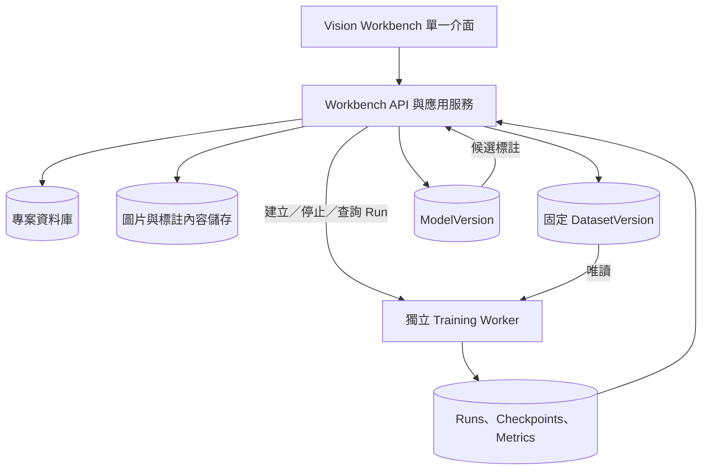
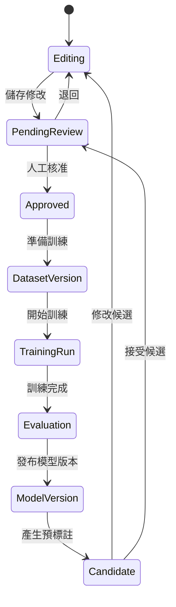

# Vision Workbench 統一產品架構

日期：2026-09-14
狀態：目標架構與遷移規劃；尚未搬移專案資料夾，也尚未移植 Training 程式碼。

## 1. 產品與專案名稱

建議正式統一如下：

| 項目 | 名稱 |
| --- | --- |
| 對外產品名稱 | **Vision Workbench** |
| 中文名稱 | **視覺資料與模型工作站** |
| Git 儲存庫名稱 | `vision-workbench` |
| 最終原始碼目錄 | `D:\software\vision-workbench` |
| Python 發行名稱 | `vision-workbench` |
| Python 主套件 | `vision_workbench` |
| Windows 使用者資料 | `%LOCALAPPDATA%\VisionWorkbench` |
| 訓練背景程序 | `vision-workbench-training` |

`graph_catch` 只作為舊儲存庫與過渡目錄名稱，不再出現在新畫面、說明文件、新資料版本或新產物中。既有資料中的來源紀錄保留原字串，避免改寫歷史證據。

2.0 交付版的本機根目錄已改為 `D:\software\vision-workbench`。程式、啟動腳本與資料路徑皆以相對位置或設定值解析，不依賴舊目錄名稱。

`C:\workspace\program\training` 是移植來源與比對基準。整合後的正式程式、測試、設定與文件全部位於 D 槽的統一儲存庫；產品執行時不得依賴 C 槽原始碼路徑。

## 2. 產品定位

Vision Workbench 是本機影像資料與模型生命週期工作站，涵蓋：

1. 專案與類別建立。
2. 圖片、影片、相機與既有資料匯入。
3. 內建編輯器、Labelme、CVAT 共用標註。
4. 人工審核與標註修訂。
5. 固定且可追溯的訓練資料版本。
6. 模型訓練、停止、紀錄及失敗復原。
7. 評估、Run 比較與模型版本管理。
8. 模型預標註回到人工修改與審核。
9. 專案備份、資料交換與模型輸出。

日常主要流程不再要求「匯出資料集，再到另一套軟體匯入」。格式轉換、資料分割和訓練資料準備仍存在，但由背景服務依固定資料版本自動執行。

## 3. 架構選擇

採用**單一產品、模組化後端、獨立訓練程序**：

- 使用者只啟動及操作 Vision Workbench。
- 桌面殼層、Web UI、專案 API 與資料庫屬於主程序。
- GPU 訓練在獨立程序與獨立 Python runtime 執行。
- 主程序是專案資料的唯一寫入者；訓練程序只讀固定的 DatasetVersion，並寫入自己的 Run 目錄。
- 兩個程序透過版本化的本機 API／事件契約溝通，不共享可變的 Python 物件或資料庫連線。



這個邊界同時保留一致操作體驗與套件隔離。Workbench 的 AI 標註環境和 Training 現有的 PyTorch／CUDA 版本不同，不應強行塞進同一個虛擬環境。

## 4. 目標原始碼結構

最終建議使用以下結構：

```text
D:\software\vision-workbench\
├─ apps\
│  ├─ desktop\                 # PySide6 桌面殼層、視窗與程序生命週期
│  ├─ api\                     # Workbench 本機 HTTP / WebSocket API
│  └─ training_worker\         # 訓練程序入口、健康檢查與工作執行
├─ src\vision_workbench\
│  ├─ domain\
│  │  ├─ projects\             # 專案、類別與設定
│  │  ├─ assets\               # 圖片、影片來源、批次與雜湊
│  │  ├─ annotations\          # Shape、RLE、修訂與衝突
│  │  ├─ review\               # 待審、核准、退回與備註
│  │  ├─ datasets\             # Split、DatasetVersion 與 readiness
│  │  ├─ training\             # Run、設定、狀態與排程
│  │  ├─ evaluation\           # 任務指標、錯誤樣本與比較
│  │  ├─ models\               # ModelVersion、能力與輸出
│  │  └─ predictions\          # 候選標註與人工接受流程
│  ├─ application\
│  │  ├─ commands\             # 寫入操作與交易邊界
│  │  ├─ queries\              # UI 查詢模型
│  │  └─ workflows\            # 審核→資料版本→訓練→評估→回填
│  ├─ infrastructure\
│  │  ├─ database\             # SQLite schema、migration、repositories
│  │  ├─ storage\              # 圖片、遮罩、資料版本與產物儲存
│  │  ├─ editors\              # 內建、Labelme、CVAT adapters
│  │  ├─ acquisition\          # 相機、影片、畫格與螢幕擷取
│  │  ├─ ai_annotation\        # SAM2、GrabCut 與候選產生
│  │  ├─ training_bridge\      # worker 啟停、API、心跳與事件回收
│  │  └─ exports\              # 備份與外部交換格式
│  └─ contracts\               # 跨程序 schema 與版本相容性
├─ engines\training\
│  ├─ backends\                # TorchVision、YOLO 等 backend adapters
│  ├─ datasets\                # Native RLE、bbox、polygon loaders
│  ├─ augmentation\            # 僅作用於 Train 的成對轉換
│  ├─ evaluation\              # detection / segmentation 指標
│  ├─ inference\               # 模型推論與候選標註輸出
│  ├─ artifacts\               # checkpoint、manifest 與模型輸出
│  └─ runtime\                 # 訓練套件鎖定與能力資訊
├─ web\
│  ├─ shell\                   # 頂部專案列、六階段導覽、背景任務列
│  ├─ pages\                   # library/acquire/editor/review/train/models
│  ├─ components\              # 共用表單、表格、狀態與對話框
│  ├─ editors\                 # 內建畫布與外部編輯器 host
│  └─ styles\                  # Workbench 設計 token 與響應式配置
├─ migrations\                 # 資料庫與資料目錄版本遷移
├─ scripts\                    # bootstrap、開發、檢查、打包與升級
├─ packaging\                  # Windows 安裝、runtime、圖示與更新資訊
├─ tests\
│  ├─ unit\
│  ├─ integration\
│  ├─ contracts\
│  ├─ workflows\
│  └─ desktop\
├─ docs\
│  ├─ architecture\
│  ├─ contracts\
│  ├─ decisions\               # ADR：重要架構決策
│  └─ validation\
├─ pyproject.toml
├─ requirements-workbench.lock
├─ requirements-training.lock
├─ bootstrap.ps1
└─ vision-workbench.bat
```

這是目標結構，不建議一次搬完。首批整合可維持目前 `workbench/`、`web/` 和測試路徑，在功能穩定後再進行目錄重整。

## 5. 模組所有權

| 模組 | 擁有的資料／行為 | 不負責 |
| --- | --- | --- |
| Projects | 專案名稱、任務類型、類別與設定 | 訓練執行 |
| Assets | 圖片內容、來源、批次、尺寸與雜湊 | 標註核准 |
| Annotations | Shape、mask、物件 ID、修訂與編輯衝突 | 決定能否訓練 |
| Review | 核准、退回、備註與審核人為動作 | 修改幾何 |
| Datasets | 固定資料版本、split、驗證與類別映射 | 修改專案標註 |
| Training | Run 設定、排程、啟停、心跳與狀態 | 直接寫專案 DB |
| Evaluation | 指標、測試集、錯誤樣本與 Run 比較 | 自動核准模型 |
| Models | 模型版本、能力、來源與輸出 | 覆蓋人工標註 |
| Predictions | 模型候選與接受／拒絕 | 直接成為已核准資料 |
| Exports | 備份、資料交換與模型輸出 | 日常訓練接線 |

## 6. 頁面資訊架構

頂部維持六個可自由切換的工作區，不做只能往前走的一次性精靈：

| 階段 | 主要頁面 | 主要操作 |
| --- | --- | --- |
| 01 專案資料庫 | 專案清單、已核准數、最近 Run、使用模型 | 開啟／建立專案 |
| 02 採集與匯入 | 圖片、資料夾、影片、相機、舊專案 | 加入專案資料 |
| 03 標註編輯 | 內建／Labelme／CVAT、圖形、類別、同步 | 儲存並送審 |
| 04 資料審核 | 待審清單、標註檢查、核准／退回 | 準備訓練 |
| 05 模型訓練 | 訓練資料、參數設定、執行紀錄 | 開始／停止訓練 |
| 06 評估與模型 | 評估結果、錯誤樣本、模型版本 | 修正標註／產生預標註 |

全域規則：

- 一頁只放一個主要青綠操作。
- 底部任務列常駐，離開訓練頁不代表停止訓練。
- `目前專案標註`、`DatasetVersion`、`TrainingRun`、`ModelVersion` 使用不同名稱和 ID。
- 技術日誌、套件版本與進階參數放在收合區，不占據主要工作區。
- 每個錯誤都提供可執行的去向，例如「查看圖片」、「調整分割」、「更換模型」。

## 7. 核心資料模型

### Project

- `project_id`：不可變 UUID。
- `name`：使用者可修改的顯示名稱。
- `task_type`：classification、detection、instance_segmentation、semantic_segmentation 等。
- `project_revision`：影像、類別或標註狀態變更時遞增。

### Asset

- `asset_id`：不可由檔名推導。
- 原始檔 SHA-256、寬高、格式與受管理內容位置。
- `source_type`、`source_batch_id`、`source_video_id`、frame index 等來源資訊。

### AnnotationRevision

- `annotation_id`、`asset_id`、revision、parent revision。
- rectangle、OBB、polygon、linestrip、point、native RLE mask。
- 每個物件固定 `shape_id`、`class_id`、metadata。
- `pending`、`approved`、`rejected` 審核狀態與原因。

### DatasetVersion

- `dataset_version_id`，顯示為 D001、D002。
- 對應 `project_id` 與建立當下的 `project_revision`。
- 固定 Asset、AnnotationRevision、class mapping、split、source group、hash。
- readiness 與轉換影響報告。
- 建立後不可修改；有新核准資料時建立新版本。

### TrainingRun

- `run_id`，顯示為 R001、R002。
- 固定 `dataset_version_id`、backend、model key、完整參數、seed、runtime fingerprint。
- queued、preparing、running、stopping、completed、failed、cancelled 狀態。
- checkpoint、metrics、log、artifact manifest 與錯誤原因。

### Evaluation

- `evaluation_id`、`run_id`、評估 DatasetVersion 與 split。
- 任務相符的整體和 per-class 指標。
- 錯誤樣本引用 asset ID，不複製成不相干的新圖片。

### ModelVersion

- `model_version_id`，顯示為 M001、M002。
- 來源 Run、架構、權重 hash、類別映射、前後處理與能力矩陣。
- 分別記錄 train、evaluate、predict、export 是否可用。

### PredictionCandidate

- 來源 model version、目標 asset、信心門檻及產生時間。
- 接受／修正後建立新的 AnnotationRevision，狀態為 pending。
- 不直接覆蓋已核准標註。

## 8. 資料生命週期



重要行為：Run 使用 D001 開始後，即使專案再修改並建立 D002，該 Run 的圖片、遮罩、split、參數與類別都保持 D001 當時狀態。

## 9. 訓練資料適配

Workbench native annotation 是唯一標準資料。不同 backend 以 adapter 取得所需表示：

```text
DatasetVersion
  ├─ Native RLE loader ───────> TorchVision Mask R-CNN
  ├─ bbox adapter ────────────> Detection backend
  ├─ polygon adapter + loss report -> YOLO segmentation
  └─ class/image adapter ─────> Classification backend
```

第一條正式路徑為 instance segmentation：

- 直接讀 Workbench native RLE／bitmap。
- 保留孔洞、多區塊與一個實例的固定 shape ID。
- bbox 由非零 mask 像素計算。
- resize 使用 nearest-neighbor 處理離散遮罩。
- 評估需提供 mask AP／IoU 等實例分割指標。
- 推論結果能轉回 PredictionCandidate。

只支援 polygon 的 backend 必須顯示近似損失。使用保真模式時，會丟失孔洞或實例關係的轉換應阻止訓練。

## 10. 程序與 Runtime

### 主程序

- PySide6 桌面視窗。
- Workbench HTTP／WebSocket API。
- SQLite 交易、專案資料、編輯器整合與一般背景工作。
- 啟動與監控 Training Worker。

### Training Worker

- 使用獨立的 `requirements-training.lock` 與 runtime。
- 綁定 `127.0.0.1` 的動態或設定連接埠。
- 啟動時由主程序交換短期 token 與 contract version。
- 一次預設執行一個 GPU 工作；可有 CPU 資料準備工作。
- 將 Run 狀態、心跳和 checkpoint 持久化。

### 資源協調

- Training、SAM2 與模型預標註共用 GPU reservation service。
- 執行中禁止更新或替換該 worker runtime。
- UI 關閉可選擇「保持背景訓練」或「停止後關閉」；兩者都要等到 worker 回覆明確狀態。
- 重開 Workbench 時重新連接存活 worker，或把失聯的 running Run 標記為 interrupted。
- 只有保存 optimizer、scheduler、scaler 與 epoch 狀態且 backend 相容時顯示「續訓」。

## 11. 本機 API 與事件契約

對 UI 的公開 API 維持同一 Workbench origin。Workbench 內部轉接 training worker，避免前端知道 worker 連接埠與 token。

建議核心命令：

```text
POST /api/projects/{project_id}/dataset-versions
GET  /api/projects/{project_id}/dataset-versions/{id}/readiness
POST /api/projects/{project_id}/training-runs
POST /api/training-runs/{run_id}/stop
GET  /api/training-runs/{run_id}
GET  /api/training-runs/{run_id}/metrics
POST /api/training-runs/{run_id}/evaluate
POST /api/models/{model_version_id}/prediction-jobs
POST /api/prediction-candidates/{candidate_id}/accept
```

跨程序 contract 帶有：

- `schema_version` 與 worker capability list。
- `request_id`、`idempotency_key`、時間戳與錯誤 code。
- project／dataset／run／model 的固定 ID。
- 只傳受管理路徑或 content ID，不接受任意使用者路徑。

重要事件：

```text
dataset.version.created
training.run.queued
training.run.started
training.run.progress
training.run.checkpointed
training.run.completed
training.run.failed
evaluation.completed
model.version.created
prediction.candidates.created
```

WebSocket 中斷後，UI 以 REST 重新查詢真實狀態，不把最後一次前端訊息當成最終結果。

## 12. 儲存配置

正式使用者資料不放在 Git 儲存庫內。每個專案是一個可搬移容器：

```text
data\projects\{project_name}__{project_id_prefix}\
├─ project.sqlite3             # 標註與模型生命週期 catalog
├─ images\                     # 內容雜湊的不可變原圖
├─ datasets\{dataset_version_id}\
├─ runs\{run_id}\
├─ models\{model_version_id}\
├─ predictions\
├─ model-exports\{export_id}\
└─ integrations\
   ├─ labelme\
   └─ cvat\                    # 專案連結、同步基準與備份
```

CVAT 容器、模型 runtime、快取與一般交換格式匯出是應用程式層資源，不放入專案容器。資料根目錄可由啟動參數覆蓋，程式不得硬編碼工作站路徑。

## 13. Training 程式移植策略

不整包複製 `C:\workspace\program\training`，改以功能為單位移植並補測試：

| Training 現有能力 | 統一架構中的落點 | 處理方式 |
| --- | --- | --- |
| readiness / start / stop | application workflows + worker API | 保留行為，改接 DatasetVersion |
| backend catalog | engines/training/backends | 移植並增加 capability matrix |
| Run manager / metrics | domain/training + engines/artifacts | 強化固定設定與 lineage |
| ProjectLayout | dataset adapter / run workspace | 不再成為第二套專案主資料 |
| annotation importer | infrastructure/exports 或舊資料遷移 | 僅供匯入，不作內部訓練主路徑 |
| TorchVision trainer | engines/training/backends/torchvision | 增加 native RLE、評估、推論 |
| YOLO trainer | engines/training/backends/yolo | 透過明確 adapter 與損失報告 |
| Training UI | 不移植 | 以 Workbench UI 重新呈現 |
| 更新／授權／runtime 檢查 | packaging + worker handshake | 保留適用規則並統一顯示狀態 |

每批移植都記錄來源 commit、原檔案、授權、已改行為與測試，不讓 D 槽專案長期依賴 C 槽工作目錄。

## 14. 錯誤、停止與復原

- DatasetVersion 建立失敗：不發布半成品，UI 回到具體錯誤清單。
- 重複點擊開始：同一 idempotency key 只建立一個 Run。
- 停止訓練：先進入 `stopping`，worker 寫完安全 checkpoint 後才變成 `cancelled`／`stopped`。
- Worker 當機：保留 Run、日誌、最後 checkpoint 與失敗原因。
- Workbench 當機：worker 依使用者設定繼續或終止；重開後對帳。
- 資料損壞：啟動 Run 前驗證所有 image／annotation hash。
- 模型不相容：readiness 直接阻止，不在訓練途中才靜默略過標註。
- 編輯器同步失敗：阻止送審或建立資料版本，保留復原檔與重試入口。

## 15. 測試與品質門檻

### 合約測試

- Workbench 與 worker contract version、能力握手與錯誤 code。
- DatasetVersion manifest、class mapping 與 artifact lineage。

### 資料保真測試

- RLE round trip 像素完全一致。
- 孔洞、多區塊、同名檔案、EXIF 尺寸與 bbox 邊界。
- 三編輯器修改後的 shape ID、class ID 與 revision 一致。

### 工作流程測試

- 標註→待審→核准→D001→R001→M001→候選→再審核。
- R001 執行中修改專案並建立 D002，R001 仍引用 D001。
- 進行中切頁、關閉／重開、停止、worker crash 與失敗重試。
- 相同測試集才能直接比較 Run。

### 第一批真實資料驗收

- 使用目前 52 張 handlebar 遮罩。
- 52 張圖片與遮罩配對正確，遮罩像素、hole、bbox 與 class mapping 不變。
- 不經手動匯出即可完成訓練、分割評估及預標註回填。
- Labelme、CVAT、內建編輯器都能看到回填後的待審修訂。
- 現有採集、標註、審核與外部匯出功能全部回歸通過。

## 16. 遷移階段

### M0：名稱與路徑去耦

- 確認產品名稱為 Vision Workbench。
- 新程式與設定不得加入 `graph_catch` 路徑依賴。
- 將資料根目錄、Training 來源、runtime 路徑全部改成設定或自動探索。
- 加入舊名稱掃描，區分程式識別與歷史 provenance。

### M1：資料版本核心

- 在 D 槽新增 DatasetVersion schema、儲存、readiness 與畫面。
- 將現有驗證和 split 從「匯出前」抽成共用應用服務。
- 用 52 張遮罩完成 immutable snapshot 驗收。

### M2：訓練引擎最小閉環

- 移植 worker 啟停、Run、TorchVision Mask R-CNN 與 artifact 管理。
- 完成 native RLE loader、mask 評估與模型推論。
- 完成開始、停止、失敗、重開對帳。

### M3：統一頁面

- 將 05 改為模型訓練，加入訓練資料／參數／執行紀錄。
- 新增 06 評估與模型。
- 錯誤樣本返回原圖，模型預標註回到待審流程。
- 原匯出功能移至專案的「備份與外部交換」。

### M4：擴充與交付

- 接入其他影像模型與任務。
- 依需求提供舊 Training 專案的一次性匯入。
- 建立兩套鎖定 runtime、安裝、更新及乾淨機器驗證。

### M5：正式重新命名

- 將套件、文件、啟動器、GitHub repo、CI 與本機設定更新為新名稱。
- 將工作目錄搬到 `D:\software\vision-workbench`。
- 重建 `.venv`，不能搬動舊虛擬環境後繼續使用。
- 驗證 Git remote、所有測試、啟動、CVAT、Labelme、資料庫及更新流程。
- 保留舊資料 provenance，不批量重寫歷史 manifest。

## 17. 首個可交付版本

首版不以「Training 的頁面放進 Workbench」作為完成標準，而以完整閉環驗收：

```text
目前專案
→ 三編輯器同步
→ 人工核准
→ 建立 D001
→ Mask R-CNN 訓練 R001
→ 分割評估
→ 建立 M001
→ 產生候選標註
→ 人工修正
→ 回到待審核
```

完成此閉環後，Vision Workbench 才真正從影像資料工作站擴充為視覺資料與模型工作站。

